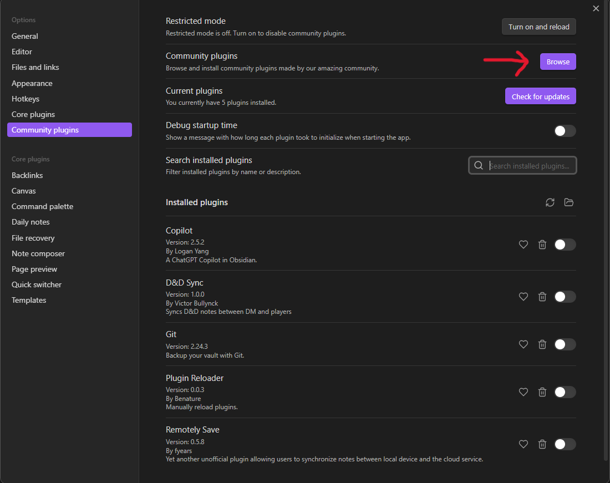

# Gedeelde D&D Obsidian Vault

Dag liefste spelers! Ik heb besloten alle info over mijn campaign te verzamelen in een Obsidian Vault maar ik heb een klein probleempje... Ik ben namelijk het grootste deel van de details vergeten :'(. Toen ging er een lichtje branden: wat als deze **vault** met iedereen gedeeld werd? Bij deze kunnen jullie net als ik zelf notes aanmaken over plaatsen, characters, story beats en dergerlijke. We kunnen altijd bullet points opschrijven, of Chat-GPT erop gooien om het een beetje mooier te verwoorden. Mijn "DM Notes" worden wel lekker van jullie verborgen >:)).

Het zijn wel een aantal stappen om tot de gezamenlijke vault te geraken, maar geen nood, jullie DM is er om jullie bij te staan!

## Installatie

Breed gezien zijn er 3 stappen die moeten gebeuren:
- **Obsidian** installeren: dit is de app die notities zeer overzichtelijk verzamelt en heel veel custimisation heeft in de vorm van plugins
- **Git** installeren: dit synchroniseert alle notities. Het kan goed zijn dat je dit al op je computer hebt staan als je je eerder al eens aan programmeren hebt gewaagd.
- Een **Github** account aanmaken: dit is de plek waar alle synchronisatie-informatie verzameld word. Ook hier kan het heel goed zijn dat je al een account hebt.

Hier is het opgesplist in kleinere stapjes, de eerste 3 kunnen tegelijkertijd gebeuren:
- Download [Obsidian](https://obsidian.md/), maak nog geen eigen vault aan
- Maak een account aan op [Github](https://github.com)
- Download [Git](https://gitforwindows.org/)
- Wanneer je een github account hebt: stuur me een berichtje met je username en ik voeg je toe aan de synchronisatie
- Wanneer dat gebeurt is: kies een plekje op je computer waar je de vault wilt opslaan. We gaan hier de *command prompt* openen. Dit kan op een aantal manieren, kies er 1
	1) Rechtermuisklik op je bureaublad en klik "Open in Terminal"
	2) Rechtermuisklik op een gepaste plek in je file explorer, en klik op "Open in terminal" 
	3) Druk tegelijkertijd op de Windows toets en de R toets. Typ in het diagloogvenster `cmd.exe` in. Je kan je navigeren doorheen je computer met het commando `cd` (change directory). Als je je hier niet confortabel mee voelt kan je het navigeren gewoon overslaan. Links van het `>` teken vind je je huidige locatie, rechts van het teken typ je je commando in. Om bij voorbeeld te navigeren naar Documents/Matlab typ je simpelweg `cd Documents/Matlab`. 
- Typ nu het volgende commando in de terminal: Dit werkt enkel als ik je toegevoegd heb op Github.
```
git clone https://github.com/BullynckVictor/DnD.git
```
- Nu heb je de vault te pakken! Open Obsidian en klik op "Open folder as vault", kies nu de folder die Git net voor je heeft aangemaakt (genaamd DnD) 
- We zijn er bijna! De laatste stap is om een plugin toe te voegen die automatisch de vault synchroniseert: Ga naar `Settings > Community plugins` en klik op "Turn on community plugins". Klik op browse plugins, zoek de git plugin en download en enable deze.    